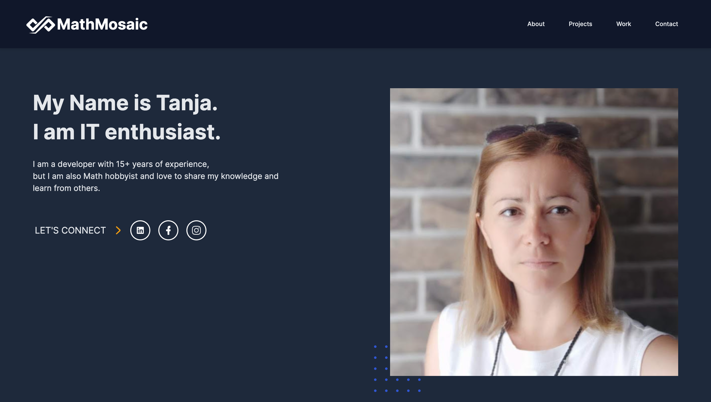

## Project Description

This is a Portfolio Landing page built with [Laravel](https://laravel.com/docs)

### How to Install
1. Clone the project
2. Create `.env` file and copy content from `.env.example`
3. Go to the project root directory and run `composer install` (`composer install --ignore-platform-reqs`)
4. Navigate to the application directory and start Laravel Sail. Laravel Sail provides a simple command-line interface for interacting with Laravel's default Docker configuration:
 `./vendor/bin/sail up`
5. Once the application's Docker containers have been started, 
you can access the application in your web browser at: `http://localhost.`

### Demo

